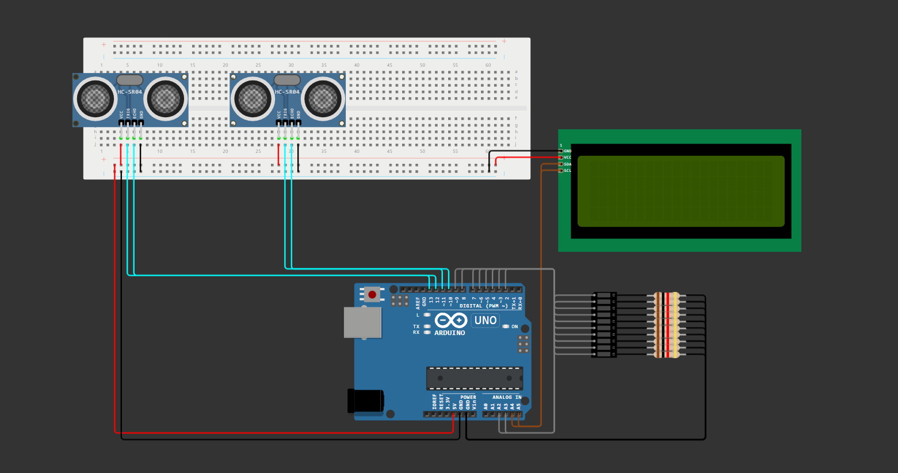

# 🏎️ CHALLENGE Mahindra

- ⚡ [Projeto no Wokwi](https://wokwi.com/projects/400505923983816705)
- 🎞️ [Vídeo de Explicação]()

## 🤖 Edge Computing & Computer Systems

Entrega da matéria Edge Computing & Computer Systems para a primeira Sprint da CHALLENGE.

## 👥 Integrantes

- RM: 556785 // Carlos Eduardo dos Santos Ribeiro Filho
- RM: 555530 // Djalma Moreira de Andrade Filho
- RM: 558447 // Felipe Paes de Barros Muller Carioba
- RM: 556506 // Nicolas Caciolato Reis
- RM: 554736 // Rafael Federici de Oliveira

## 📕 Sobre o Projeto

### ✨ Visão geral do projeto

Este projeto refere-se ao site desenvolvido com o objetivo de popularizar e mostrar, de melhor forma, o que é a Fórmula-E, aqui, no Brasil.
A percepção de que a Fórmula-E é apenas uma divisão secundária da Fórmula 1 deve deixar de existir e, é com este pensamento, que desenvolvemos nosso site para uma percepção mais agradável do público em relação ao esporte de automobilismo elétrico fórmula.
Focamos em não desvincular totalmente a fórmula E dos veículos à combustão, mas sim, mostrar as semelhanças e comparações sutis entre ambos. (Inclusive, tal ato pode ser visto na propaganda do EP de Tokyo de 2024, que chamaram Sung Kang, ator do Han, de Velozes e Furiosos, para gravar um comercial com diversos veículos à combustão personalizados e customizados. Tal propaganda possuía o intuito de promover a Fórmula E com sua estética e vincular a Fórmula E com corridas de rua).
Utilizaremos de um site intuitivo, customizável e imersivo para um melhor agrado do usuário. Com isto, traremos comparações com a Fórmula 1 sobre estatísticas, tempo de volta, velocidade, entre outros.
Decidimos que, focar em estética, vínculo com corridas em cenários de rua, tecnologia e acessibilidade, seria o ideal para a popularização da Fórmula E no Brasil, visto que, o brasileiro se interessa por esses quatro pontos.
No Brasil, no ano de 2022, a venda de veículos elétricos aumentou em 78%, com mais de 50 mil unidades vendidas, indicando que o brasileiro começa a aceitar o veículo elétrico.

### 🤖 Visão geral em Edge Computing & Computer Systems

Este projeto consiste em um radar de velocidade, que será utilizado para medir a velocidade de um corpo ao passar por um ponto inicial até chegar a um ponto final, com o intuito de colher dados de corridas e treinos da Fórmula-E para usa-los em nosso site.

### 🖼️ Print do circuito

</img>

## 🔨 Ferramentas

- [Arduino UNO](https://docs.arduino.cc/hardware/uno-rev3/)
- [Linguagem Arduino](https://www.arduino.cc/reference/pt/)
- [C++](https://learn.microsoft.com/pt-br/cpp/?view=msvc-170)

## 🖥️ Requisitos e Componentes

### 🔧 Requisitos

- Simulador: [Wokwi](https://wokwi.com/)
- IDE: [ArduinoIDE](https://www.arduino.cc/en/software)

### 📄 Componentes Utilizados

- [Arduino UNO:](https://docs.wokwi.com/pt-BR/parts/wokwi-arduino-uno) Controlar os demais componentes.
- [LCD_I2C:](https://docs.wokwi.com/pt-BR/parts/wokwi-lcd2004) Mostrar visualmente as informações.
- 2x [Sensores de Distância Ultrassônico HC-SR04:](https://docs.wokwi.com/pt-BR/parts/wokwi-hc-sr04) Iniciar as mediçoes da velociade (Ponto inicial e Ponto final).
- [LEDbar:](https://docs.wokwi.com/pt-BR/parts/wokwi-led-bar-graph) Exibir gráficamente a velocidade.

### 🔌 Conexões dos Componentes

- [LCD_I2C:](https://docs.wokwi.com/pt-BR/parts/wokwi-lcd2004) Entradas analógicas A5 e A4 do arduino, respectivamente para os pinos SCL e SDA.
- [1º Sensor de Distância Ultrassônico HC-SR04:](https://docs.wokwi.com/pt-BR/parts/wokwi-hc-sr04) Entradas digitais 13 e 12 do arduino, respectivamente para os pinos trigger e echo.
- [2º Sensor de Distância Ultrassônico HC-SR04:](https://docs.wokwi.com/pt-BR/parts/wokwi-hc-sr04) Entradas digitais 11 e 10 do arduino, respectivamente para os pinos trigger e echo.
- [LEDbar:](https://docs.wokwi.com/pt-BR/parts/wokwi-led-bar-graph) Entradas digitais 9, 8, 7, 6, 5, 4, 3 e 2, e entradas analógicas A3 e A2 do arduino, respectivamente para os pinos Ânodos da LEDbar do 10 ao 1;

## 📒 Instruções de Uso

### 🖥️ Simulador
- Abrir o [projeto no Wokwi](https://wokwi.com/projects/399769764705866753)
- Iniciar a simulação no botão 'Start the simulation'
- Altere os valores dos sensores de distância ultrassônico HC-SR04, para iniciar a medição da velocidade
- Observar os dados apresentados no LCD_I2C

### 🖥️ ArduinoIDE
- Monte o circuito em uma placa ArduinoUNO, conectando cada pino dos componentes em suas respectivas entradas.
- Carregue o código deste repositório através do ArduinoIDE.
- Altere os valores dos sensores de distância ultrassônico HC-SR04, para iniciar a medição da velocidade
- Observar os dados apresentados no LCD_I2C

## 🧠 Explicando o Código

### 📚 Incluir a seguinte biblioteca no projeto:
``` c++
#include <LiquidCrystal_I2C.h>
```

### 📝 Declarando variáveis para cada compenente utilizado
``` c++
LiquidCrystal_I2C lcd(0x27, 20, 4);

int trigger01 = 13;
int echo01 = 12;
int trigger02 = 11;
int echo02 = 10;

int ledBar[] = {9, 8, 7, 6, 5, 4, 3, 2, A3, A2};
int numLeds = 10;
```

### 📝 Declarando variáveis do sistema.
``` c++
float leitura01 = 0;
float leitura02 = 0;
float cm01 = 0;
float cm02 = 0;

bool leitura01Iniciou = false;
bool leitura02Iniciou = false;

unsigned long tempoInicial = 0;
unsigned long tempoFinal = 0;
float intervalo = 0;
float distancia = 100;
float velocidadeMps = 0;
float velocidadeKph = 0;
```

void setup() do arduino:
### 🔰 Inicializa e define os pinModes dos componentes.
``` c++
void setup() {
  Serial.begin(9600);

  lcd.init();
  lcd.backlight();

  pinMode(trigger01, OUTPUT);
  pinMode(echo01, INPUT);
  pinMode(trigger02, OUTPUT);
  pinMode(echo02, INPUT);

  for(int i = 0; i < numLeds; i++) {
    pinMode(ledBar[i], OUTPUT);
  }

  Serial.println("Pronto para iniciar medições");
}
```

void loop() do arduino:
### ▶️ Inicia a captação e conversão de dados do primeiro sensor de distancia ultrasonico.
``` c++
void loop() {
  digitalWrite(trigger01, LOW);
  delayMicroseconds(5);
  digitalWrite(trigger01, HIGH);
  delayMicroseconds(5);
  digitalWrite(trigger01, LOW);

  leitura01 = pulseIn(echo01, HIGH);

  cm01 = leitura01 / 58.0;
```

### 🔎 Bloco de comando para iniciar a medição do primeiro sensor de distancia ultrasonico.
``` c++
  if(cm01 <= 300 && !leitura01Iniciou) {
    delay(50);
    if(cm01 <= 300) {
      tempoInicial = millis();
      leitura01Iniciou = true;
      Serial.println("Leitura do Sensor 01 Iniciada");
    }
  }
```

### ▶️ Inicia a captação e conversão de dados do segundo sensor de distancia ultrasonico.
``` c++
  digitalWrite(trigger02, LOW);
  delayMicroseconds(5);
  digitalWrite(trigger02, HIGH);
  delayMicroseconds(5);
  digitalWrite(trigger02, LOW);

  leitura02 = pulseIn(echo02, HIGH);

  cm02 = leitura02 / 58.0;
```

### 🔎 Bloco de comando para iniciar a medição do segundo sensor de distancia ultrasonico.
``` c++
  if(cm02 <= 300 && leitura01Iniciou && !leitura02Iniciou) {
    delay(50);
    if(cm02 <= 300) {
      tempoFinal = millis();
      leitura02Iniciou = true;
      Serial.println("Leitura do Sensor 02 Iniciada");
```

### ⏱️ Calculando intervalo de tempo e velocidade, e exibindo dados no LCD
``` c++
      intervalo = (tempoFinal - tempoInicial) / 1000.0;
      Serial.print("Intervalo de Tempo: ");
      Serial.print(intervalo);
      Serial.println(" segundos");

      velocidadeMps = distancia / intervalo;
      velocidadeKph = (float)(distancia / 1000.0) / (float)(intervalo / 3600.0);
      Serial.print("Velociade (m/s): ");
      Serial.print(velocidadeMps);
      Serial.println(" m/s");
      Serial.print("Velociade (km/h): ");
      Serial.print(velocidadeKph);
      Serial.println(" km/h");

      leitura01Iniciou = false;
      leitura02Iniciou = false;

      lcd.setCursor(0, 0);
      lcd.print("Velocidade:");
      exibirLCD(0, 1, velocidadeMps, ">", "m/s");
      exibirLCD(0, 2, velocidadeKph, ">", "km/h");
      delay(500);
    }
  }
```

### 🚦 Bloco de verificação para ligar a LEDbar
``` c++
  if(velocidadeMps != 0 && velocidadeKph != 0) {
    ligarLEDbar(velocidadeKph, ledBar);
    delay(500);
  }
}
```

### 💻 Função para apagar uma linha do LCD.
``` c++
void apagarLinha(int coluna, int linha) {
  lcd.setCursor(coluna, linha);
  for(int i = coluna; i < (20 - coluna); i++)
    lcd.print(" ");
  lcd.setCursor(coluna, linha);
}
```

### 💻 Função para exibir informações no LCD.
``` c++
void exibirLCD(int coluna, int linha, float variavel, String mensagem, String medida) {
  apagarLinha(coluna, linha);
  lcd.setCursor(coluna, linha);
  lcd.print(mensagem);
  lcd.print(" ");
  lcd.print(variavel);
  lcd.print(" ");
  lcd.print(medida);
}
```

### 🚦 Função para ligar a LEDbar.
``` c++
void ligarLEDbar(float variavel, int lista[]) {
  if(variavel >= 300) {
    for(int i = 0; i < 10; i++) {
      digitalWrite(lista[i], HIGH);
    }
  } else if(variavel >= 200) {
    for(int i = 0; i < 8; i++) {
      digitalWrite(lista[i], HIGH);
    } 
  } else if(variavel >= 150) {
    for(int i = 0; i < 6; i++) {
      digitalWrite(lista[i], HIGH);
    }
  } else if(variavel >= 100) {
    for(int i = 0; i < 4; i++) {
      digitalWrite(lista[i], HIGH);
    }
  } else if(variavel >= 75) {
    for(int i = 0; i < 2; i++) {
      digitalWrite(lista[i], HIGH);
    }
  } else if(variavel >= 50) {
    for(int i = 0; i < 1; i++) {
      digitalWrite(lista[i], HIGH);
    } 
  }
  delay(5000);

  for(int i = 0; i < 10; i++) {
    digitalWrite(lista[i], LOW);
  }
}
```